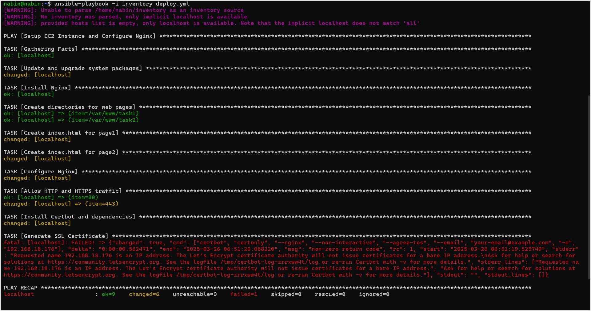

# Task2 : Writing an Ansible playbook (Manual Process):
*Automated script is given below at last*
## 1. Launching an EC2 instance using any AMI of my desire 
- launched ubuntu server on my VMware
- updated System using
<pre>sudo apt update</pre>
- nginx already installed, verified using
<pre>nginx -v</pre>
- configured the default nginx fiel
<pre>
server {
    listen 80;
    server_name _;

    location /page1 {
        root /var/www/task1;
        index index.html;
    }

    location /page2 {
        root /var/www/task2;
        index index.html;
    }
}
</pre>

- Created a file using
<pre>
sudo mkdir var/www/task1/index.html
sudo mkdir var/www/task2/index.html
</pre>

- Enabling ssl certificate via nginx default
<pre>
server {
    listen 443 ssl;
    server_name nabinpuybey.com.np;

    ssl_certificate /etc/letsencrypt/live/nabinpuybey.com.np/fullchain.pem;
    ssl_certificate_key /etc/letsencrypt/live/nabinpuybey.com.np/privkey.pem;

    location / {
        root /var/www/task1;
        index index.html;
    }
}

server {
    listen 80;
    server_name nabinpuybey.com.np;
    return 301 https://$host$request_uri;
}
</pre>

# Automated ansible playbook
- Installed `ansible` using following command
<pre>sudo apt update && sudo apt install -y ansible</pre>
- `deploy.yml`
<pre>
---
- name: Setup EC2 Instance and Configure Nginx
  hosts: localhost
  become: yes
  vars:
    ansible_user: ubuntu
    domain_name: 192.168.18.176

  tasks:

    - name: Update and upgrade system packages
      apt:
        update_cache: yes
        upgrade: yes

    - name: Install Nginx
      apt:
        name: nginx
        state: present

    - name: Create directories for web pages
      file:
        path: "{{ item }}"
        state: directory
        owner: www-data
        group: www-data
        mode: '0755'
      loop:
        - /var/www/task1
        - /var/www/task2

    - name: Create index.html for page1
      copy:
        dest: /var/www/task1/index.html
        content: "<h1>Welcome to Page 1</h1>"
        owner: www-data
        group: www-data
        mode: '0644'

    - name: Create index.html for page2
      copy:
        dest: /var/www/task2/index.html
        content: "<h1>Welcome to Page 2</h1>"
        owner: www-data
        group: www-data
        mode: '0644'

    - name: Configure Nginx
      copy:
        dest: /etc/nginx/sites-available/default
        content: |
          server {
              listen 80;
              server_name _;

              location /page1 {
                  root /var/www/task1;
                  index index.html;
              }

              location /page2 {
                  root /var/www/task2;
                  index index.html;
              }
          }
      notify:
        - Restart Nginx

    - name: Allow HTTP and HTTPS traffic
      ufw:
        rule: allow
        port: "{{ item }}"
        proto: tcp
      loop:
        - "80"
        - "443"

    - name: Install Certbot and dependencies
      apt:
        name: certbot
        state: present

    - name: Generate SSL Certificate
      command: certbot certonly --nginx --non-interactive --agree-tos --email your-email@example.com -d "{{ domain_name }}"
      args:
        creates: "/etc/letsencrypt/live/{{ domain_name }}/fullchain.pem"
      notify:
        - Restart Nginx

    - name: Configure Nginx with SSL
      copy:
        dest: /etc/nginx/sites-available/default
        content: |
          server {
              listen 443 ssl;
              server_name {{ domain_name }};

              ssl_certificate /etc/letsencrypt/live/{{ domain_name }}/fullchain.pem;
              ssl_certificate_key /etc/letsencrypt/live/{{ domain_name }}/privkey.pem;

              location /page1 {
                  root /var/www/task1;
                  index index.html;
              }

              location /page2 {
                  root /var/www/task2;
                  index index.html;
              }
          }

          server {
              listen 80;
              server_name {{ domain_name }};
              return 301 https://$host$request_uri;
          }
      notify:
        - Restart Nginx

    - name: Add SSH key to the user
      authorized_key:
        user: ubuntu
        key: "{{ lookup('file', '~/.ssh/id_rsa.pub') }}"
        state: present

  handlers:
    - name: Restart Nginx
      service:
        name: nginx
        state: restarted
</pre>

- Outout
<pre>ansible-playbook -i inventory deploy.yml</pre>

---
# Reference
[Linux Machine Download](https://ubuntu.com/download)
 
[Writing a Docker file](https://docs.docker.com/get-started/docker-concepts/building-images/writing-a-dockerfile/)
 
[Docker Installation in Ununtu Server](https://docs.docker.com/engine/install/ubuntu/)
 
[Nginx Installation in Ubuntu](https://nginx.org/en/linux_packages.html#Ubuntu)
 
[Markdown Cheat Sheet](https://www.markdownguide.org/cheat-sheet/)
 
[Ansible Ideas](https://docs.ansible.com/?extIdCarryOver=true&sc_cid=701f2000001OH7EAAW)
 
[Ansible Automation](https://docs.redhat.com/en/documentation/red_hat_ansible_automation_platform/2.5)
 
[GitHub Actions Tutorial](https://www.youtube.com/watch?v=R8_veQiYBjI)
 
[Ansible Tutorial](https://www.youtube.com/watch?v=y2TSR7p3N0M)
 
[Github Workflows Tutorial](https://www.youtube.com/watch?v=ookIfjc8dW0)
 
[Nginx Configuration Tutorial](https://www.youtube.com/watch?v=C5kMgshNc6g)
 
`...and more`